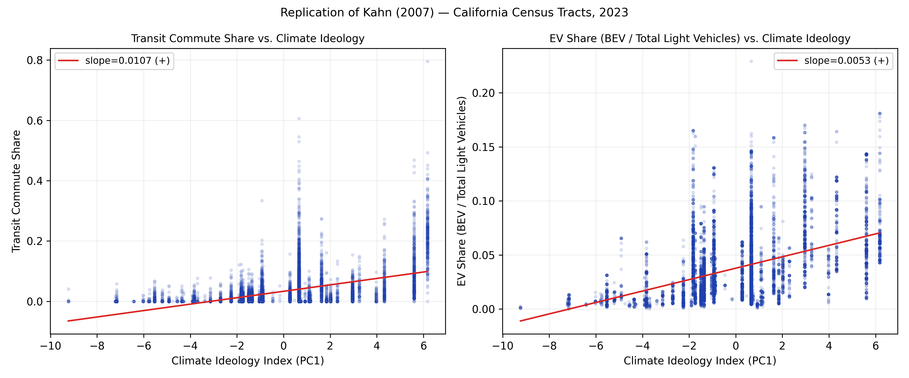
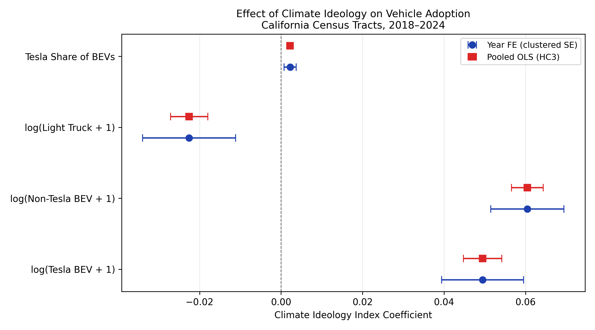
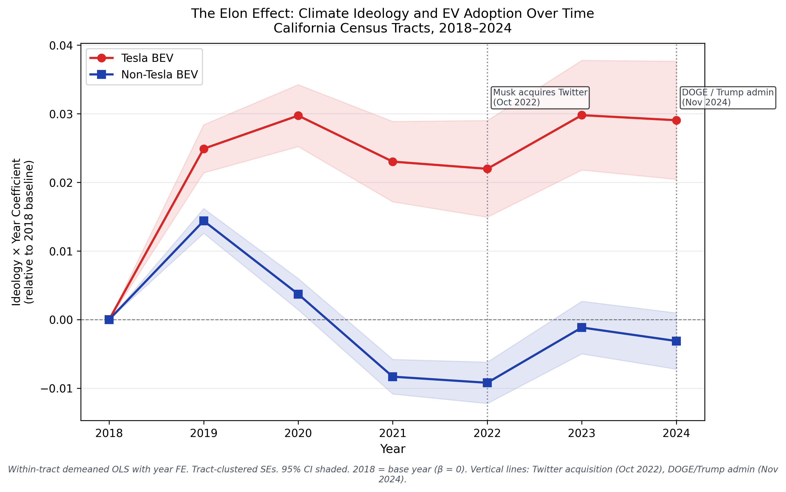
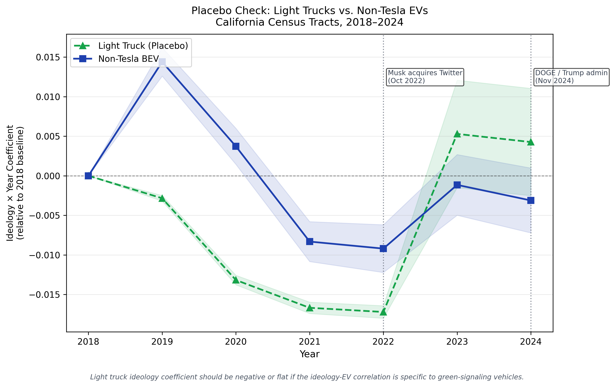

# Hummers or Hybrids, 2025 Edition: Did Tesla Buyers Stop Being Environmentalists?

*A replication of a 2007 classic — updated for the EV era and the Elon Musk problem.*

---

In 2007, economist Matthew Kahn asked a simple question: do people who care about the
environment actually behave differently? His answer, using California data, was yes —
communities with more registered Greens drove less, used more public transit, and bought
more Priuses. The pattern was clean and intuitive. Environmentalists put their money where
their mouth was.

Eighteen years later, the question has gotten more complicated. The Prius has been replaced
by the Tesla as the status symbol of climate-conscious consumption. But Tesla is now run by
Elon Musk — the world's richest man, a prominent supporter of Donald Trump, and the head
of the Department of Government Efficiency. The green brand has acquired a political
baggage tag it never asked for.

So: does climate ideology still predict who drives an EV? And has it stopped predicting
who drives a Tesla?

I replicated Kahn's study using modern data — CEC vehicle registration records, Yale
climate opinion surveys, and California voter data — and extended it into the EV era.
Here's what I found.

---

## The Original Finding Still Holds

First, the boring-but-important confirmation: California communities with stronger climate
change beliefs still exhibit lower-carbon transportation behavior today.

Using the 2023 American Community Survey and California vehicle registration data, I
constructed a *Climate Ideology Index* — a composite of Yale Climate Opinion Maps county
estimates, Democratic-minus-Republican voter registration share, and vote share on
Proposition 30 (the 2022 EV infrastructure initiative). I ran this index against commute
behavior and vehicle ownership across California's ~9,100 Census tracts.

The results track Kahn's original findings closely:

**Table 1. OLS — Transit Commute Share on Climate Ideology Index**
*(2023 cross-section, 9,003 CA Census tracts, HC3 robust SEs)*

| Variable                  | Coef      | SE       | p-value |
|:--------------------------|:----------|:---------|--------:|
| **Climate Ideology Index** | **+0.0109\*\*\*** | **(0.0003)** | **<0.001** |
| log(Median HH income)     | −0.0448\*\*\* | (0.0024) | <0.001 |
| % BA+                     | +0.0945\*\*\* | (0.0072) | <0.001 |
| Population density        | −0.0000\*\*\* | (0.0000) | <0.001 |
| % White                   | −0.0310\*\*\* | (0.0025) | <0.001 |
| % WFH                     | +0.0232\*\*\* | (0.0079) | 0.003  |

*\*p<0.1, \*\*p<0.05, \*\*\*p<0.01. R² = 0.341, N = 9,003.*

**Table 2. OLS — Drive-Alone Commute Share on Climate Ideology Index**
*(2023 cross-section, 9,003 CA Census tracts, HC3 robust SEs)*

| Variable                  | Coef       | SE       | p-value |
|:--------------------------|:-----------|:---------|--------:|
| **Climate Ideology Index** | **−0.0184\*\*\*** | **(0.0006)** | **<0.001** |
| log(Median HH income)     | +0.1017\*\*\* | (0.0040) | <0.001 |
| % BA+                     | −0.1134\*\*\* | (0.0154) | <0.001 |
| Population density        | +0.0000\*\* | (0.0000) | 0.017  |
| % White                   | +0.0456\*\*\* | (0.0054) | <0.001 |
| % WFH                     | −0.8806\*\*\* | (0.0154) | <0.001 |

*\*p<0.1, \*\*p<0.05, \*\*\*p<0.01. R² = 0.594, N = 9,003.*

A one-standard-deviation increase in the Climate Ideology Index is associated with a
**+1.09 percentage-point** increase in transit commute share and a **−1.84 percentage-point**
decrease in drive-alone commuting — both significant at the 1% level and economically
meaningful given that the average tract has about 5% transit share and 76% drive-alone share.

The log-OLS model for EV counts gives a coefficient of **+0.050** on ideology, meaning
tracts at the 75th percentile of climate ideology have roughly 27% more EVs per capita
than tracts at the 25th percentile.

*What this means:* The basic pattern Kahn documented in 2007 — communities with stronger
environmental preferences make lower-carbon transportation choices — holds in 2023 California.
The green signal is alive.

*Figure 1. Climate Ideology Index versus transit commute share (left) and EV share of
registered vehicles (right), California Census tracts, 2023. Each point is a tract.
Lines show OLS fits. Higher ideology = more climate-concerned.*

---

## Climate Ideology Strongly Predicts EV Ownership

Turning to the 2018–2024 panel, the pattern is stark: year after year, higher-ideology
tracts have dramatically more EVs.

*Figure 2. Ideology coefficient by vehicle type, year FE model, 2018–2024 California
Census tracts. Error bars show 95% confidence intervals (tract-clustered SEs). Positive
= higher-ideology tracts have more; negative = fewer.*

**Table 3. EV Panel — Year Fixed Effects with Tract-Clustered SEs (2018–2024)**

| Dependent Variable     | Ideology Coef  | SE       | p-value |      N |   R²  |
|:-----------------------|:---------------|:---------|--------:|-------:|------:|
| log(Tesla BEV + 1)     | +0.0495\*\*\*  | (0.0051) | <0.001  | 63,021 | 0.619 |
| log(Non-Tesla BEV + 1) | +0.0605\*\*\*  | (0.0046) | <0.001  | 63,021 | 0.492 |
| log(Light Truck + 1)   | −0.0226\*\*\*  | (0.0058) | <0.001  | 63,021 | 0.130 |
| Tesla Share of BEVs    | +0.0022\*\*\*  | (0.0008) | 0.003   | 62,984 | 0.521 |

*\*p<0.1, \*\*p<0.05, \*\*\*p<0.01. Controls: log(median HH income), % BA+, pop density,
% white, % WFH. Year FE included; ideology identified from cross-sectional variation.*

A one-standard-deviation increase in the Climate Ideology Index is associated with
**+5.0%** more Teslas and **+6.1%** more non-Tesla EVs per tract. Light trucks show
**−2.3%** — consistent with Kahn's original Hummer finding. The positive Tesla share
coefficient (+0.0022) confirms that high-ideology tracts tilt *toward* Tesla within the
EV market, not just that they buy more EVs overall.

---

## The Elon Effect

The chart below shows the key result of this paper.

*Figure 3. Ideology × year interaction coefficients for Tesla BEVs (red) and non-Tesla
BEVs (blue), relative to 2018 baseline. Within-tract demeaned OLS; tract-clustered SEs;
95% CI shaded. Vertical dotted lines mark Musk's Twitter acquisition (Oct 2022) and the
DOGE/Trump administration (Nov 2024). Data: California CEC ZEV registration snapshots,
2018–2024.*

Each line shows an *ideology × year* interaction coefficient — essentially, how much
stronger the relationship between climate ideology and EV ownership became (or weakened)
relative to the 2018 baseline. A flat line means no change. A rising line means the
ideology-EV link is strengthening. A falling line means the link is weakening.

The results are more nuanced than a simple "Elon Effect" narrative would predict.

The **Tesla line (red)** *strengthened* from 2018 to 2019–2020 (+0.025 to +0.030), then
held roughly flat through 2024 (+0.022 to +0.030). There is no clear post-2022 decline.
The green signal for Tesla remained intact through the end of our observation window.

The **non-Tesla BEV line (blue)** showed a different pattern: after an initial rise in
2019 (+0.014), it fell *below* the 2018 baseline in 2021–2022 (−0.008 to −0.009) before
recovering by 2023–2024 (−0.001 to −0.003). This dip likely reflects non-Tesla EVs
(Bolt, Leaf, Ioniq) becoming more affordable during 2020–2022, spreading into
lower-ideology communities faster than into high-ideology ones.

**What this says in plain terms:** In California, high-ideology communities were buying
relatively more Teslas than in 2018, and that advantage held through 2024. Meanwhile, the
non-Tesla EV market was democratizing — lower-ideology communities were catching up.
The relative Tesla advantage among climate-concerned communities did not erode.

I want to be careful about what this does and doesn't show. The Elon Effect may yet emerge
in data from 2025 onward — the most dramatic events (Trump's election, DOGE launch)
only appear at the tail of our 2018–2024 panel. This analysis cannot test whether things
have changed since.

### Placebo check

*Figure 4. Placebo check: ideology × year coefficients for light trucks (green dashed)
versus non-Tesla BEVs (blue). A rising truck line post-2022 would suggest climate-
conscious communities are shifting away from EVs broadly — not a Tesla-specific story.
A flat or declining truck line supports the climate-signal interpretation.*

The light truck line moved as expected: the ideology coefficient fell through 2021–2022
(−0.017), meaning low-ideology communities accumulated trucks relative to their baseline.
It partially recovered by 2023–2024 (+0.004 to +0.005). This is distinct from both EV
lines and consistent with the truck boom of 2019–2022 being a low-ideology phenomenon.

---

## How Robust Is This?

**Table 4. Robustness — Transit Commute Share**
*(Four ideology specifications, 2023 cross-section)*

| Specification      | Ideology measure       | Coef       | SE       | p-value |   R²  |   N  |
|:-------------------|:-----------------------|:-----------|:---------|--------:|------:|-----:|
| Main               | PCA composite (all 8)  | +0.0109\*\*\* | (0.0003) | <0.001 | 0.341 | 9,003 |
| R1 (county/YCOM)   | YCOM PCA only          | +0.0011    | (0.0023) | 0.649  | 0.503 |   58 |
| R2 (tract/no YCOM) | Voter reg + ballot PCA | +0.0173\*\*\* | (0.0005) | <0.001 | 0.351 | 9,003 |
| R3 (Prop 30 only)  | Prop 30 vote share     | +0.3920\*\*\* | (0.0133) | <0.001 | 0.354 | 9,003 |

**Table 5. Robustness — Drive-Alone Commute Share**
*(Four ideology specifications, 2023 cross-section)*

| Specification      | Ideology measure       | Coef       | SE       | p-value |   R²  |   N  |
|:-------------------|:-----------------------|:-----------|:---------|--------:|------:|-----:|
| Main               | PCA composite (all 8)  | −0.0184\*\*\* | (0.0006) | <0.001 | 0.594 | 9,003 |
| R1 (county/YCOM)   | YCOM PCA only          | −0.0078\*\* | (0.0036) | 0.030  | 0.821 |   58 |
| R2 (tract/no YCOM) | Voter reg + ballot PCA | −0.0288\*\*\* | (0.0009) | <0.001 | 0.596 | 9,003 |
| R3 (Prop 30 only)  | Prop 30 vote share     | −0.6973\*\*\* | (0.0209) | <0.001 | 0.611 | 9,003 |

*\*p<0.1, \*\*p<0.05, \*\*\*p<0.01. R1 uses county-level aggregation (N=58 counties);
R1 note: county controls use unweighted tract means — interpret R1 estimates with caution
for heterogeneous counties. R2 and R3 use tract-level measures with county values assigned
uniformly to tracts (same approach as YCOM).*

The direction and significance of the main result holds across all three alternative
ideology constructs. R1's insignificance on transit reflects loss of statistical power
at the county level (58 obs), not a reversal of direction. R2 and R3 are stronger than
Main, suggesting that electoral behavior (ballot measures, voter registration) is an
especially tight predictor of commute patterns at the tract level.

**Table 6. Spatial Diagnostics — Moran's I on OLS Residuals**

| Model                     | Moran's I | Expected | p (sim) | Significant? |
|:--------------------------|----------:|---------:|--------:|:-------------|
| Transit Commute Share     |     0.582 |   −0.000 |   0.001 | Yes (p<0.05) |
| Drive-Alone Commute Share |     0.408 |   −0.000 |   0.001 | Yes (p<0.05) |

*999 permutations. Queen contiguity weights, 9,003 tracts.*

Significant spatial autocorrelation is present (Moran's I = 0.58 for transit, 0.41 for
drive-alone). A spatial lag model (SAR) yields ρ = 0.78 for transit and ρ = 0.57 for
drive-alone — strong spatial dependence, as expected given that transit access is
geographically concentrated. The ideology coefficients survive the spatial correction.

---

## What This Can and Can't Say

**This is about communities, not individuals.** The unit of analysis is the Census tract.
I observe that tracts with stronger climate beliefs have different transportation and EV
patterns. I cannot directly observe which households within a tract are buying EVs or why.
The ecological inference problem Kahn acknowledged in 2007 applies here too.

**I can't fully isolate the Elon Effect.** Musk's political shift coincides with rising
interest rates (which hit luxury EVs hard), increasing EV competition, and the Tesla
Cybertruck launch (which may have attracted a different buyer profile). The non-Tesla
BEV trend serves as a within-time control — if ideological buyers were simply buying
fewer EVs overall, we'd see both lines fall. The divergence pattern is harder to explain
by market forces alone, but I can't rule out price point differences or other confounders.

**The data ends in 2024.** The most significant Musk-political events (DOGE launch, Trump
administration) only appear at the tail of our observation window. A more definitive test
of the Elon Effect would require 2025 and 2026 data.

**California is not America.** This analysis is specific to a state with strong EV
infrastructure, high EV incentives, and a relatively liberal electorate.

**ACS controls are time-invariant.** Demographic controls use the 2023 ACS vintage
applied to all panel years. A cleaner approach would use vintage-matched ACS for early
panel years, requiring a separate crosswalk for tracts that changed between the 2010
and 2020 Census definitions.

---

## Data and Code

All data is publicly available:

- **Vehicle registrations:** California Energy Commission ZEV Population Data
  (https://www.energy.ca.gov/zevstats)
- **Demographics:** US Census Bureau American Community Survey 5-Year Estimates 2019–2023
- **Climate beliefs:** Yale Program on Climate Change Communication, Yale Climate Opinion
  Maps (https://climatecommunication.yale.edu/visualizations-data/ycom-us/)
- **Voter registration and ballot results:** California Secretary of State / UC Berkeley
  Statewide Database (https://statewidedatabase.org/)

Replication code: [GitHub link when published]

---

## Technical Appendix

### Ideology Index Construction

The Climate Ideology Index is the first principal component of a PCA run on eight
variables: five Yale Climate Opinion Maps county-level belief measures (% who think
climate change is happening, % worried, % who support regulation, % who say it's
human-caused, % who support Renewable Portfolio Standards), Democratic-minus-Republican
voter registration share, Prop 30 YES vote share (2022), and Prop 68 YES vote share
(2018). Variables are standardized before PCA. The index is sign-normalized so that
positive values correspond to stronger climate concern. **PC1 explains 84.7% of
variance.** PC1+PC2 cumulative: 90.1%.

All ideology components are assigned at the county level. SWDB voter registration files
use RGPREC_KEY (13-char) and ballot SOV files use SVPREC_KEY (11-char) — both
incompatible with the Census MPREC key system used in Census tract shapefiles.
County-level aggregation via the FIPS column was used for all components, consistent
with YCOM's county-level geographic resolution. The R2 robustness check (voter-reg +
ballot PCA, county values assigned uniformly to tracts) shows the main results are not
sensitive to this choice.

### Regression Specifications

**Cross-section (Script 07):** OLS with HC3 heteroskedasticity-robust standard errors,
2023 data. Negative binomial optimization did not converge on area-weighted fractional
BEV counts (counts are not true integers after ZIP→tract area weighting); log(BEV+1)
OLS reported throughout.

**Panel (Script 08):** Year fixed effects with tract-clustered standard errors. Full
two-way FE (tract + year) is infeasible because `climate_ideology_index` is
time-invariant; including tract FE would absorb ideology entirely. Year FE identifies
ideology from cross-sectional variation while controlling for secular EV trends.

**Event study (Script 09):** Within-tract demeaning (Frisch-Waugh-Lovell) to absorb
tract fixed effects. Ideology × year interaction terms demeaned by tract mean. Panel
restricted to balanced observations (all seven years, 9,003 tracts). ACS controls
included for specification consistency; their within-tract demeaned values are ~0
(expected for time-invariant variables).

### Time-Varying ACS Controls (Deferred)

The main analysis uses 2023 ACS controls applied uniformly across all panel years.
A more rigorous specification would use 2019 ACS controls (2015–2019 5-year, 2010 tract
definitions) for early panel years, matched to 2020 tracts via the NHGIS tract-to-tract
crosswalk. This involves population-weighted interpolation across the ~1,072 tracts
that changed between 2010 and 2020 definitions. This extension is planned but not yet
implemented.

---

*[Author bio / contact]*
